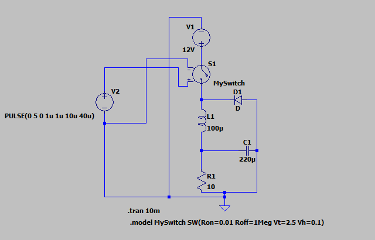
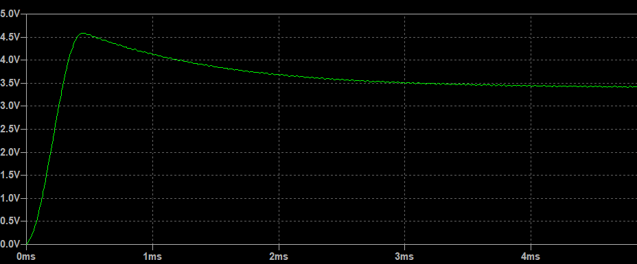
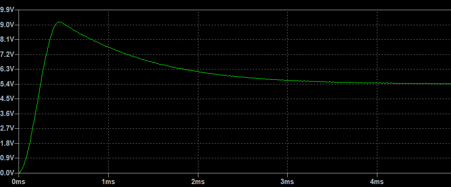
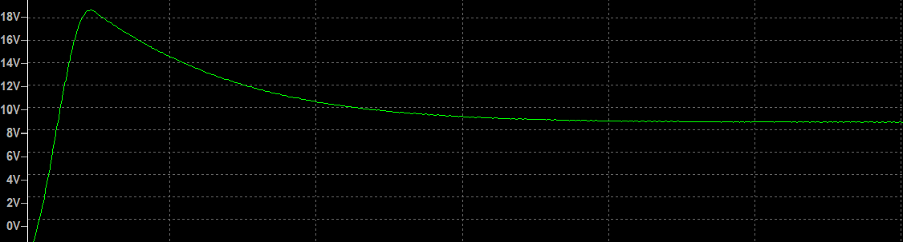
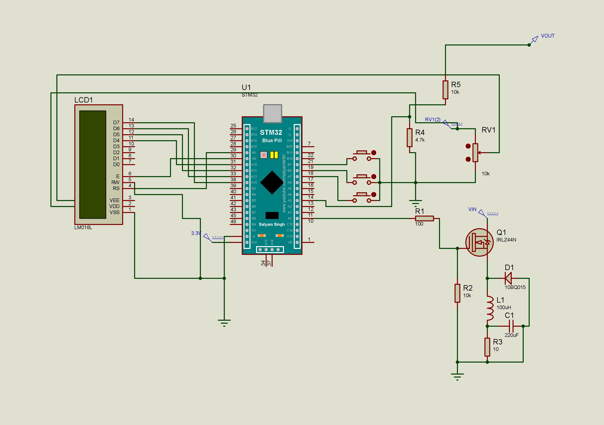
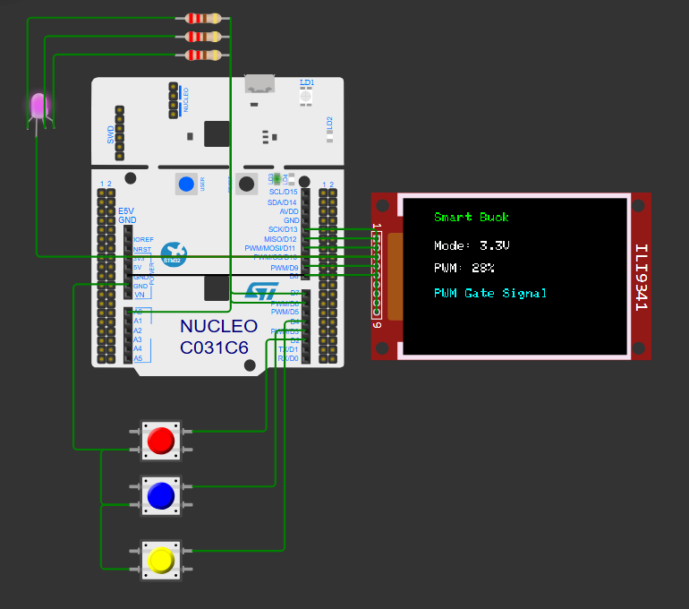
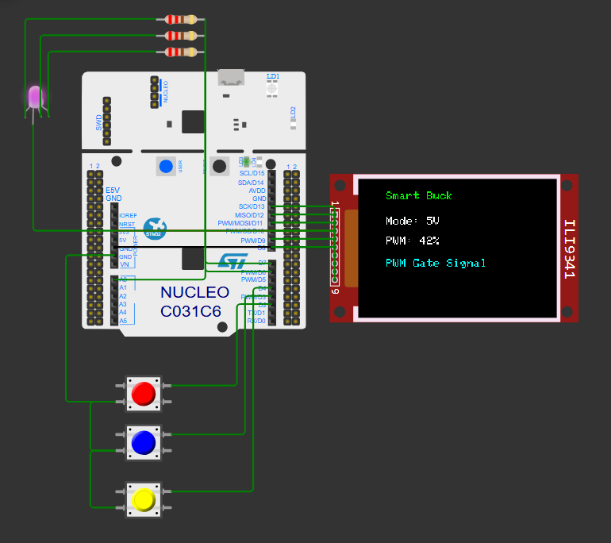
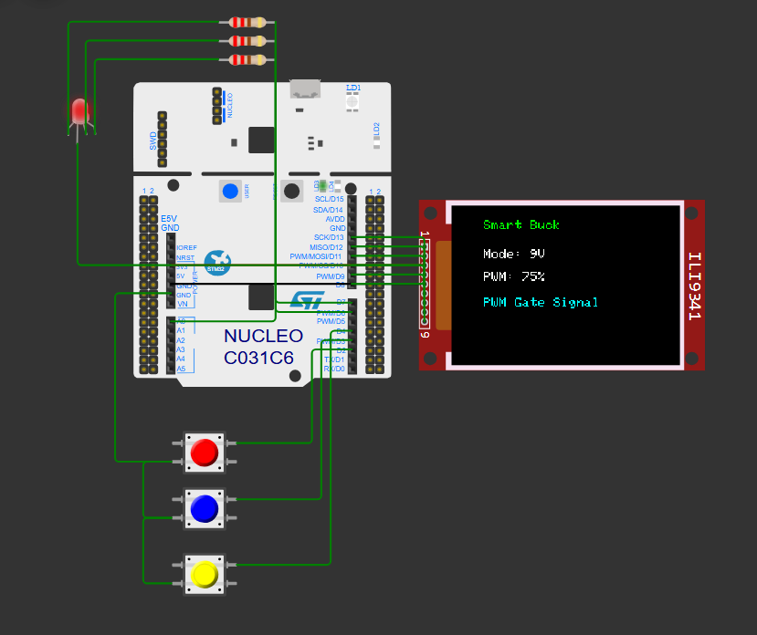
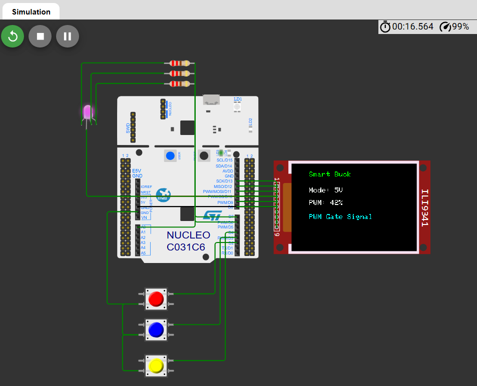

## Development Workflow

### 1. LTspice Analysis

The buck converter power stage was first analyzed in LTspice to understand PWM-based voltage control and converter behavior.

#### LTspice Circuit

#### Case 1

#### Case 2

#### Case 3

---

### 2. Proteus Hardware Design

A complete hardware schematic was developed in Proteus using STM32 and buck converter components.

---

### 3. Wokwi Firmware Development

#### Test 1 – 3.3V Mode

#### Test 2 – 5V Mode

#### Test 3 – 9V Mode

#### Final Wokwi Circuit

